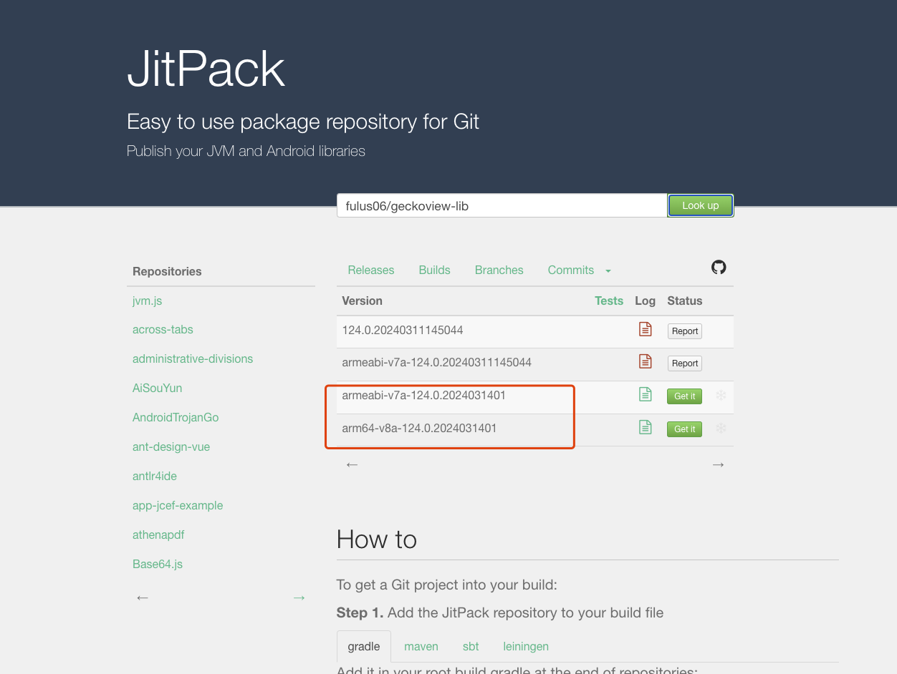

# GeckoView-lib

将GeckoView打包到jitpack仓库，供uniappx使用


### 步骤

* 创建releases

* 将`https://github.com/fulus06/geckoview-lib.git`链接复制到下图，点击`Look up`按钮

  

* 点击相应的`Get it`按钮即可。示例：

  ```groovy
  dependencies {
      implementation 'com.github.fulus06:geckoview-lib:arm64-v8a-124.0.2024031401'
  }
  ```

  

